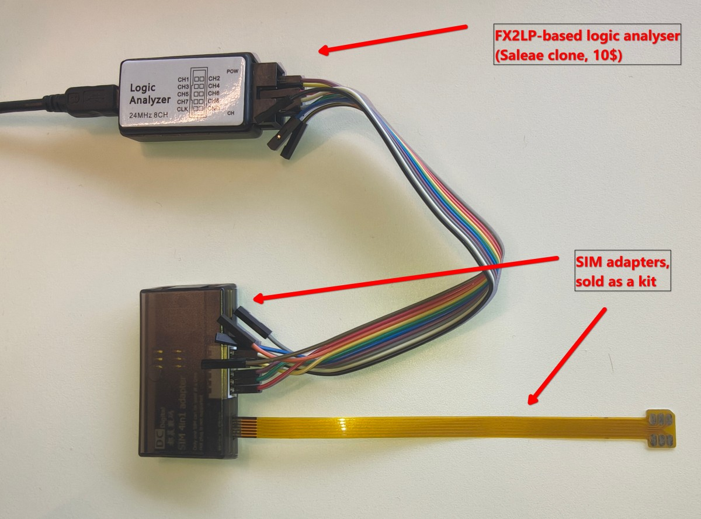
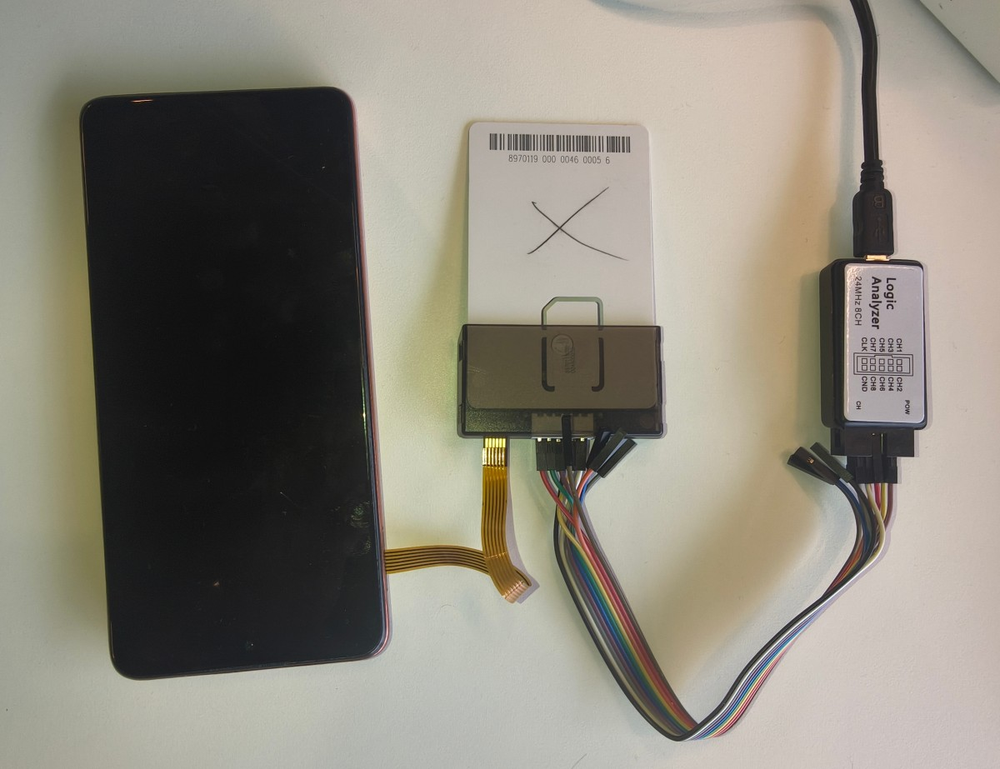
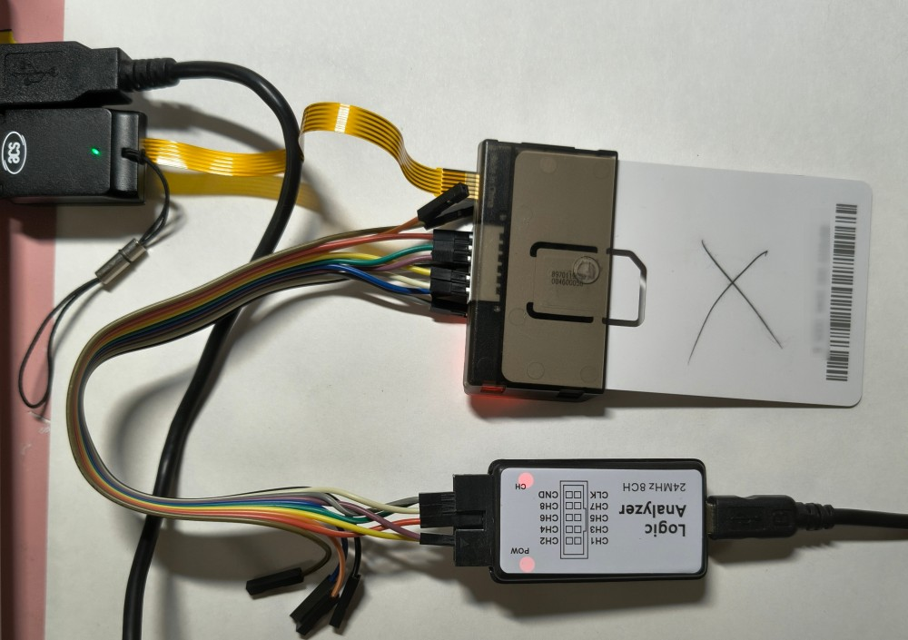
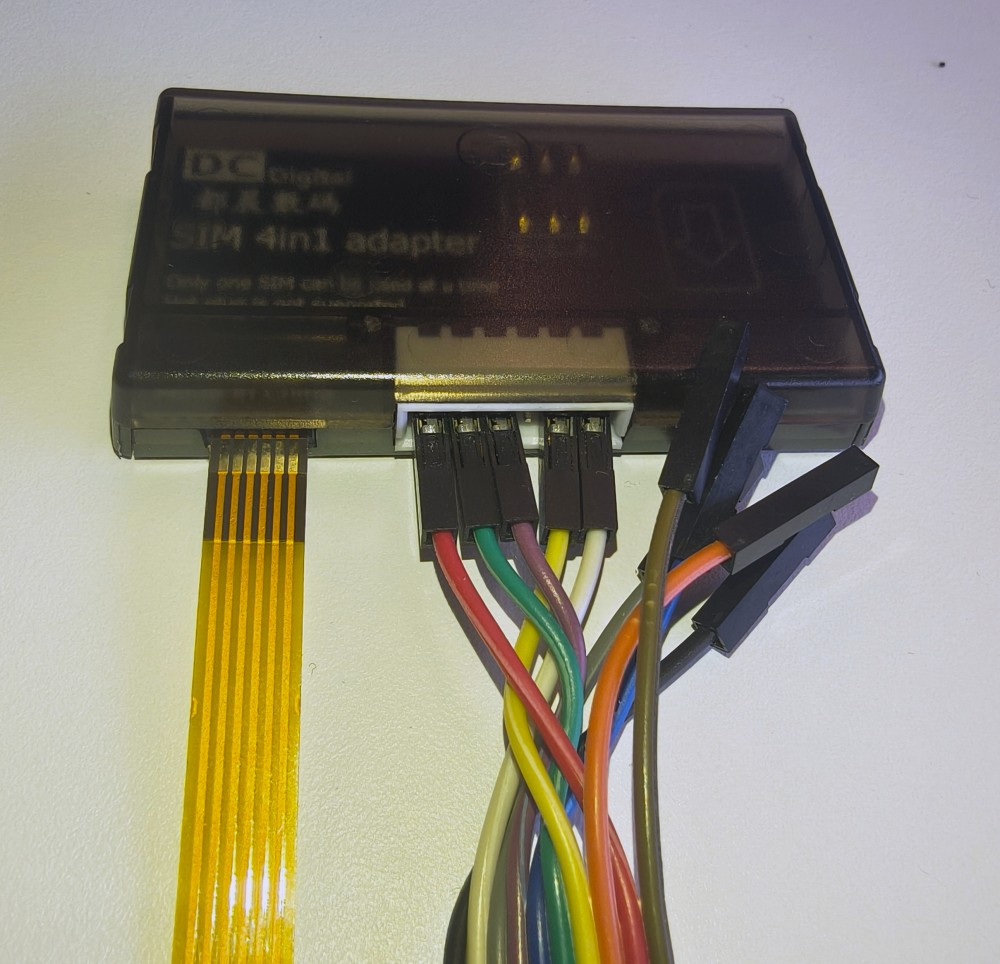
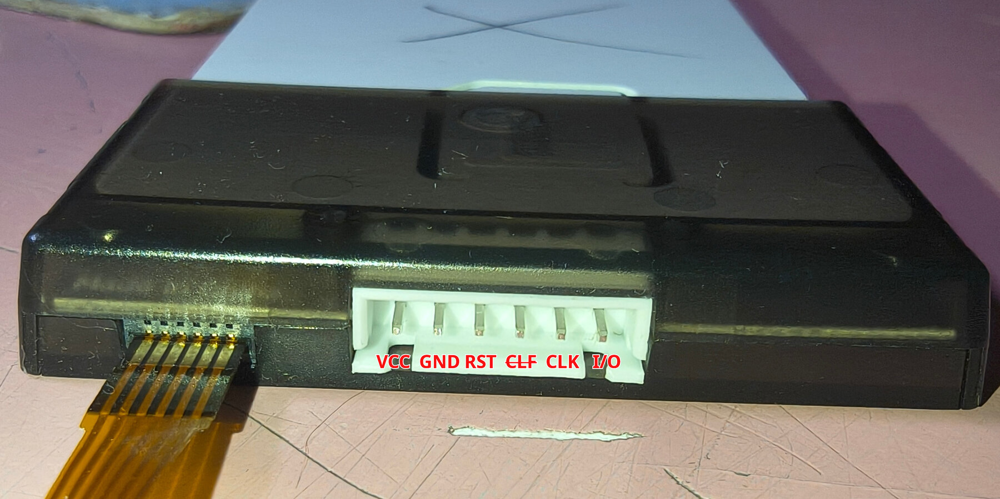

# sigrok_iso7816_stream

Fork of [svenso/sigrok_iso7816](https://github.com/svenso/sigrok_iso7816) with
**live GSMTAP UDP streaming**, making a cheap FX2 logic analyzer (Saleae clone)
behave like a SIMtrace2 sniffer:

```
SIM card ⇄ reader (passive tap on the contacts)
    → FX2 logic analyzer (fx2lafw, 8ch, 24MHz max)
    → sigrok-cli + iso7816 decoder
    → GSMTAP UDP :4729  →  simtrace2-pysniff / Wireshark
```

## The tap in practice


*Components used in the build*


*The rig tapping a phone SIM session*


*The rig tapping a card-reader session*


*The SIM-tap adapter*


*Tap wiring on the SIM contacts*

## What was added on top of upstream

| Feature | Description |
|---------|-------------|
| Live GSMTAP stream | Every decoded event is sent as a GSMTAP-SIM UDP packet (default on, mimics simtrace2-sniff) |
| Correct sub_types | ATR=0x01 and PPS=0x02 now tagged properly in PCAP output (upstream hardcoded everything to APDU=0x00) |
| ATR/PPS in PCAP | ATR and combined PPS request+response are emitted as PCAP packets |
| RST tracking (optional) | `rst_detect=true`: emits reset assert/deassert events (sub_type 0x10) |
| VCC tracking (optional) | `vcc_detect=true`: emits power on/off events (sub_type 0x11) |
| Direct PCAP file | `pcap_file=<path>` writes PCAP without shell redirection |

## Decoder options

| Option | Default | Description |
|--------|---------|-------------|
| `clock_option` | `native` | `native`, `detect`, `sample_as_clock` (see upstream FAQ) |
| `protocol` | `auto` | `auto`, `T=0`, `T=1` |
| `starts_with_atr` | `false` | Capture starts with an ATR |
| `gsmtap_enable` | `true` | Live GSMTAP UDP streaming |
| `gsmtap_host` | `127.0.0.1` | GSMTAP destination host |
| `gsmtap_port` | `4729` | GSMTAP destination port |
| `pcap_file` | *(empty)* | Write PCAP to this file in addition to binary output |
| `rst_detect` | `false` | Track RST pin events (requires the `rst` channel to be assigned) |
| `vcc_detect` | `false` | Track VCC pin events (requires the `vcc` channel to be assigned) |

Channels: `clk`, `data` (required); `rst`, `vcc` (optional — assign only when
the corresponding wire is physically connected).

## GSMTAP events

GSMTAP header: version 2, type SIM (0x04), UDP port 4729.

| sub_type | Name | Payload |
|----------|------|---------|
| 0x00 | APDU | raw T=0/T=1 packet bytes |
| 0x01 | ATR | raw ATR bytes |
| 0x02 | PPS | PPS request + response bytes concatenated |
| 0x10 | RST event (custom) | `[direction, level, 0x00]` |
| 0x11 | VCC event (custom) | `[direction, level, 0x00]` |

Event payload byte semantics:
- RST: `direction` 1 = reset asserted (high→low), 0 = deasserted (low→high);
  `level` = line level after the transition.
- VCC: `direction` 1 = power applied (low→high), 0 = removed (high→low);
  `level` = line level after the transition.

0x10/0x11 are custom extensions not defined in libosmocore's gsmtap.h.

## Usage

Quick start after cloning (see Installation below):

```bash
./setup.sh   # check sigrok-cli, register decoder symlink
./start.sh   # capture + GSMTAP stream to 127.0.0.1:4729
```

`start.sh` defaults: pins D1=CLK, D6=I/O, D0=RST, D4=VCC, 16 MHz samplerate.
Override via args:

```bash
./start.sh --clk=D5 --data=D6          # different wiring
./start.sh --no-rst --no-vcc           # CLK+I/O only
./start.sh --host=10.0.28.7            # stream to a remote analyser
./start.sh --pcap=session.pcap         # also record decoded events to PCAP
./start.sh --debug                     # verbose libsigrokdecode logging
```

### Detecting the wiring (`tools/detect_pins.py`)

Not sure which FX2 channel carries which SIM signal? The probe loops
short captures until the wiring map is complete:

```bash
python3 tools/detect_pins.py              # live probe (default): trigger a
                                          # SIM reset when prompted
python3 tools/detect_pins.py capture.sr   # or analyze an existing capture
```

Each segment fingerprints every channel (toggle rate, idle level, median
inter-transition gap, first-rise ordering across VCC -> RST -> ATR).
Ambiguous static lines are reported as such instead of guessed; the run
ends with the detected mapping and a ready-to-paste `start.sh` command
line -- partial mappings still print usable flags for the known channels.
Requires numpy.

> **GND is not detectable.** It carries no signal to fingerprint, so the
> tool cannot find or verify it.  Plug it first and check it manually
> (continuity meter or known-good contact) -- a missing or loose ground
> masquerades as every other fault at once: floating lines, phantom
> start bits, all-zero frames.

### Robustness against noisy signals

Live captures can glitch (a phantom start bit during power-up used to
shift the whole ATR parse off-by-one). The decoder now:

- validates the ATR's TS byte (`0x3B`/`0x3F` per TS 102 221 §5.2.2) and
  resyncs on the next real falling edge if it is bogus;
- never lets a decode exception kill the capture — errors are logged,
  annotated, and the state machine resyncs (end-of-stream still exits
  cleanly);
- bounds T=1 block-chain follow-up so garbage cannot loop forever.

After an accepted PPS the decoder **follows the speed switch**: in
native CLK mode `clock_skip` becomes F/D CLK cycles per bit (e.g.
512/16 = 32), matching both sides' new UART rate.  Live capture
confirmed that keeping 372 after PPS aliases all subsequent traffic.

A **warm reset** (the reader re-asserts RST every ~1.6 s) makes the card
answer with a fresh ATR at the default 372 cycles/bit. The decoder
**re-arms the ATR hunt on RST deassert**: state back to `FIND START`,
native skip reset to 372, hunt count cleared — so the re-ATR parses as
an ATR instead of being mis-read as TPDU traffic at the PPS-negotiated
rate. A **1.5-ETU start-bit guard** additionally rejects the phantom
`0x00` an idle glitch can insert before that ATR. Requires
`rst_detect=true` (the `rst` channel assigned); without it a mid-session
reset is still mis-read.

### Troubleshooting live capture

`start.sh` runs a single `--continuous` capture until you press **Ctrl+C**
(`rc=130`). stdin is detached from sigrok-cli, so pressing keys/Enter in
the terminal does **not** stop it (sigrok's "press any key to stop
acquisition" prompt is disabled) — that keypress was previously
mis-read as a "premature abort", but there was never a device fault.

Most of the early "noise" seen in captures (parity errors, mis-framed
garbage, a bouncing VCC line) was a badly-decoded state machine, not the
hardware: re-seating the tap did nothing, while the decoder rewrite fixed
it completely (warm-reset re-arm, 1.5-ETU start-bit guard, 10 ms VCC
debounce, T=0 exchange reassembly). A clean capture now decodes to zero
garbage — see the `vs_reader.py` validation below.

If a capture *does* end on its own (`rc=0`), the device genuinely stopped
streaming; the FX2's USB bandwidth ceiling at sustained high sample rates
is the usual suspect.

```bash
./start.sh --pcap=s.pcap --log=s.log           # also record decoded events, log rc=
./start.sh ... --samplerate=24M                # more timing headroom if needed
./start.sh ... --klog                          # also record kernel journal
./start.sh ... --debug                         # libsigrok internals at -l 4
```

`start.sh` captures a continuous stream at the configured rate (default 16
MHz) until Ctrl+C (`rc=130`). A healthy capture never ends by itself; if the
FX2 drops the USB transfer mid-session (a flaky device, `rc=0` "device
stopped streaming"), pass `--loop` to auto-restart — it re-launches the
capture on every `rc=0` until you press Ctrl+C or hit `--max-restarts=N`
(default 20; `0` = unlimited), with a `--restart-delay=S` gap (default 2 s).

- `--loop` auto-restarts the capture when it ends on its own (`rc=0`).
- `--max-restarts=N` caps restarts (default 20; `0` = unlimited).
- `--restart-delay=S` seconds to wait between restarts (default 2).
- `--log` captures the `rc=` verdict line for the session end.
- The decoder logs `SIGNAL INTEGRITY WARNING` when >= 8 of the last
  64 frames fail parity.
- Desynced TPDUs (mis-framed exchanges) are kept but flagged with
  `GSMTAP_FLAG_BAD_FCS` in the GSMTAP header `res` byte — visible in
  Wireshark as a BAD-FCS warning.

Performance: in native CLK mode the decoder calibrates samples per CLK
edge once from the ATR's first frame, then advances bit timing with
single sample-skip waits instead of one wait per CLK edge. The PPS speed
switch is followed via `clock_skip = F/D`; there is no post-PPS or
parity-triggered recalibration.

### Mode comparison on FX2 hardware (A/B result)

- `native` decoded real traffic (ATR, PPS switch, 100+ valid APDUs in a
  12 s window); the one persistent artifact was the VCC sense line
  "bouncing" — the ~1 kHz ringing the 10 ms debounce now suppresses.
- `detect` never produced a usable session on this rig: it missed the
  PPS speed switch entirely (no PPS handling fired), aliasing all
  post-PPS traffic; a second attempt caught a dead I/O line.

`native` stays the default. Use `--clock=detect` only for offline
experiments without PPS. A run full of all-zero frames means the tap
lost contact with a line.

Parity is **even** per TS 102 221 ("an even number of bits set to '1'
including the parity bit"); frames failing the check are flagged as
`CHKSUM ERROR` but still decoded.

Equivalent raw sigrok-cli commands:

```bash
# Minimal: CLK+I/O only, live stream to localhost:4729
sigrok-cli -d fx2lafw --config samplerate=12M --continuous \
  -P iso7816:clk=D0:data=D1:clock_option=detect -A iso7816

# Full wiring: CLK + I/O + RST + VCC with line event tracking
sigrok-cli -d fx2lafw --config samplerate=12M --continuous \
  -P iso7816:clk=D1:data=D6:rst=D0:vcc=D4:clock_option=native:rst_detect=true:vcc_detect=true \
  -A iso7816

# Stream to a remote analyser / disable streaming / write PCAP file
... -P iso7816:...:gsmtap_host=10.0.28.7 ...
... -P iso7816:...:gsmtap_enable=false ...
... -P iso7816:...:pcap_file=trace.pcap ...

# Classic upstream mode: binary PCAP to stdout
sigrok-cli -i capture.sr -P iso7816:clk=2:data=0 -B iso7816=pcap > out.pcap
```

### Pin mapping

The FX2 clone channels are assigned via `-P iso7816:clk=N:data=N:rst=N:vcc=N`
(no re-plugging needed when wires are mixed up). Default tap wiring used by
`start.sh`:

| FX2 channel | SIM contact | Signal |
|-------------|-------------|--------|
| D0 | C2 | RST |
| D1 | C3 | CLK |
| D4 | C1 | VCC (digital level only!) |
| D6 | C7 | I/O |
| GND | C5 | GND |

FX2 input threshold is TTL-ish (~1.4V): 1.8V-class cards may read unreliably;
3V/5V classes are fine.

**Samplerate and 8-bit mode (important):** the FX2's nominal 24 MHz is only
available when sampling in 8-bit mode, i.e. when **only channels D0–D7 are
enabled**. Enabling the 9th channel (A0/analog on CWAV AX clones) or any
analog input forces 16-bit collection, which libsigrok caps at 12 MHz.
`start.sh`/`start.bat` therefore pass `-C D0,D1,D2,D3,D4,D5,D6,D7`
explicitly and default to **16 MHz** (comfortably under the 24 MHz USB
bandwidth ceiling; ~3.3 samples per 4.8 MHz clock cycle). `setup.sh`/
`setup.bat` probe and report your hardware's actual maximum under the
same restriction.

## Installation

### Linux

```bash
git clone git@github.com:anttro/sigrok_iso7816_stream.git
cd sigrok_iso7816_stream
./setup.sh
```

`setup.sh` verifies sigrok-cli and the FX2 firmware package
(`sigrok-firmware-fx2lafw`) are installed, symlinks the repo into
`~/.local/share/libsigrokdecode/decoders/iso7816` (user-local decoders shadow
system-wide ones), and probes the connected device for its maximum supported
samplerate.

### Windows

Prerequisites:

1. **Python 3.8+** from python.org ("Add to PATH" during install), then:
   `pip install numpy`
2. **sigrok-cli** Windows installer (0.7.2 x86_64) from
   [sigrok.org/wiki/Downloads](https://sigrok.org/wiki/Downloads).
   If it fails to start with error `0xc0150002`, install the
   [Visual C++ 2010 Redistributable](https://www.microsoft.com/en-us/download/details.aspx?id=26999)
   (`msvcr100.dll` is required by the bundled Python runtime).
3. fx2lafw firmware ships bundled with the installer — no separate download.

Driver setup (FX2 dongles need WinUSB, the vendor driver won't work):

- Run **Zadig**, which ships *inside* the sigrok-cli installation directory
  (also reachable from the Start menu). Select the FX2 device in its dropdown
  and install the **WinUSB** driver.
- After firmware upload the device re-enumerates with a different VID/PID —
  if it still isn't found, run Zadig a **second time** for the re-enumerated
  entry.
- Windows binds drivers per USB port when no serial number is present:
  moving the dongle to another port may require repeating Zadig.

Then:

```bat
git clone git@github.com:anttro/sigrok_iso7816_stream.git
cd sigrok_iso7816_stream
setup.bat
```

`setup.bat` verifies sigrok-cli and bundled firmware, registers this repo's
decoder via a junction into `%LOCALAPPDATA%\libsigrokdecode\decoders\iso7816`
(confirmed by `sigrok-cli -L` listing `iso7816`), checks Python/numpy for
`tools\detect_pins.py`, and probes the device's accepted samplerates.

Capture works the same as on Linux:

```bat
tools\detect_pins.py        rem find the wiring (loops segments until done)
start.bat                   rem capture + GSMTAP stream
```

Note: batch files need CRLF line endings; the repo enforces this via
`.gitattributes`, so a fresh clone on Windows is already correct.

## RST/VCC detection notes and limitations

- Events are detected **asynchronously before the first ATR** (power-on /
  reset release are captured once the level is stable) and **at packet
  boundaries** between T=0/T=1 packets afterwards.
- Edges occurring entirely *within* a packet transfer are observed as a net
  level change at the next boundary; short pulses inside a packet can be missed.
- VCC is digital-only: the decoder sees powered/not-powered, never the
  voltage class (1.8/3/5V).
- **RST and VCC use level-stability hysteresis at 10 ms** (samplerate-scaled):
  a new level is reported only once it has been continuously stable for ≥ 10 ms
  — either because it persists that long, or because it ends after being stable
  that long.  This makes power-up and power-down *symmetric*: a VCC sense line
  that **rings on the rising edge** (noisy/floating tap) no longer loses its
  "VCC on" event — it fires once the line settles HIGH, instead of being eaten
  by edge debounce.  RST uses the same scheme, so a brief RST glitch no longer
  triggers a phantom warm-reset re-arm.
- **VCC events are generally unreliable — prefer not to track VCC.** A floating
  or unconnected VCC sense pin reads HIGH at all times (logic-high with no load),
  so the decoder sees "powered" constantly and emits spurious power events on
  every bounce.  Unless your tap derives VCC from a clean, loaded source, it is
  better to **leave the `vcc` channel unassigned** (do not pass `--vcc`) and keep
  `vcc_detect=false`; RST tracking is usually enough to see resets.  Only enable
  VCC tracking on a tap with a solid VCC sense (and a solid GND — see wiring notes).
- Unassigned optional channels are ignored even if `rst_detect`/`vcc_detect`
  is enabled (guarded via `has_channel()`).

## Testing

Verified against the upstream example captures:

```bash
# ATR+PPS+1396 APDUs from sim_turnon_2_clicking_around_ds.sr (~19s decode)
# GSMTAP stream verified with tshark (ATR/APDU dissected natively),
# custom 0x10/0x11 events verified with a UDP listener, and end-to-end
# into simtrace2-pysniff server (POST /api/capture/start → decode → stop).
```

A synthetic VCD generator covering RST/VCC edge cases lives in the project
notes (`projects/SIGROK_ISO7816.md` in the parent workspace).

### Validation against the reader SDK (`tools/vs_reader.py`)

On a controlled rig (PCSC reader driven by software) the reference APDU log
from the reader SDK can be diffed against the decoded PCAP:

```bash
sigrok-cli -i examples/test_8_raw16.sr \
  -P iso7816:clk=D1:data=D6:rst=D0:vcc=D4:clock_option=native:rst_detect=true:vcc_detect=true:gsmtap_enable=false:pcap_file=out.pcap \
  -A iso7816
python3 tools/vs_reader.py examples/test_8_reader.log out.pcap
```

`vs_reader.py` aligns each reader-log exchange to the capture APDUs
(byte-exact LCS match) and classifies the leftovers as proactive/CAT
(unseen by the reader SDK), pre-capture/dropped, or garbage.
`examples/test_8_raw16.sr` (`test_8_reader.log`) is the mid-session capture
whose warm resets previously produced 4 garbage events — with the re-arm +
start-bit guard it decodes to **0 garbage** (`RESULT: OK - capture fully
explained`).

The `examples/` directory holds replayable fixtures: `sim_turnon_*` and
`sunrise_*` are upstream boot captures, `test_7_raw16.sr` / `test_8_raw16.sr`
are 16 MHz controlled-rig sessions with their reader-SDK ground-truth logs.

### Capture scenarios: reader (constant CLK) and phone (Clock Stop Mode)

The decoder handles the two physically different SIM sniffing setups:

- **Reader / constant-CLK capture** — the reader drives a steady CLK for the
  whole session. With `starts_with_atr` either `true` or `false` the capture
  decodes to **0 garbage** (`RESULT: OK`) in both modes against the reader-SDK
  ground truth (`tools/vs_reader.py examples/test_8_reader.log out.pcap`).
  ATR-based captures use the sample-skip bit reader; mid-session reader
  captures (warm resets) use the synthetic-T=0-ATR fallback.

- **Phone / stopped-CLK capture** — the phone gates or stops CLK between
  transfers (Clock Stop Mode), so the ETU is not the 372-clock default and
  cannot be inferred from CLK. Run with `starts_with_atr=false` and
  `protocol=T=0`; the decoder recovers the ETU (~53 samples) from the DATA
  line via edge counting, locks it, and decodes with the drift-immune
  edge-list bit reader. T=0 case 3/4 commands (e.g. `80 12`/`80 14` STK
  envelope) are consolidated into a single command→response APDU. Example:
  `examples/phone_reference_live_16M.sr` decodes to coherent APDUs with the
  STK menu text (Roam, I-WLAN, Show IMEI, …) fully readable and no
  `0xff`/`0xfc` sync garbage.

Recommended invocations:

```bash
# Reader capture (controlled rig, CLK always running)
sigrok-cli -i examples/test_8_raw16.sr \
  -P iso7816:clk=D1:data=D6:rst=D0:vcc=D4:clock_option=native:rst_detect=true:vcc_detect=true:starts_with_atr=true:gsmtap_enable=false:pcap_file=out.pcap \
  -A iso7816
python3 tools/vs_reader.py examples/test_8_reader.log out.pcap

# Phone capture (mid-session, gated/stopped CLK)
sigrok-cli -i examples/phone_reference_live_16M.sr \
  -P iso7816:clk=D1:data=D6:rst=D0:clock_option=native:rst_detect=true:vcc_detect=false:protocol=T=0:starts_with_atr=false:gsmtap_enable=false:pcap_file=out.pcap \
  -A iso7816
```

## License

GPL-2.0+, same as upstream.
