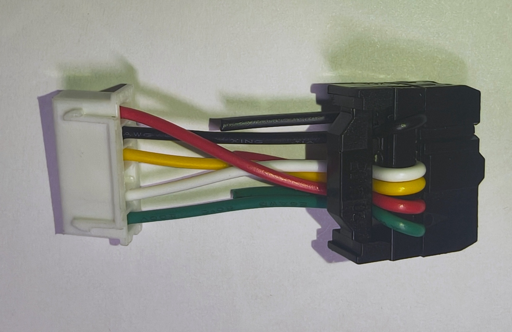
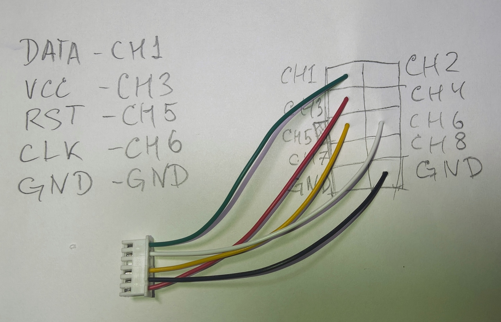
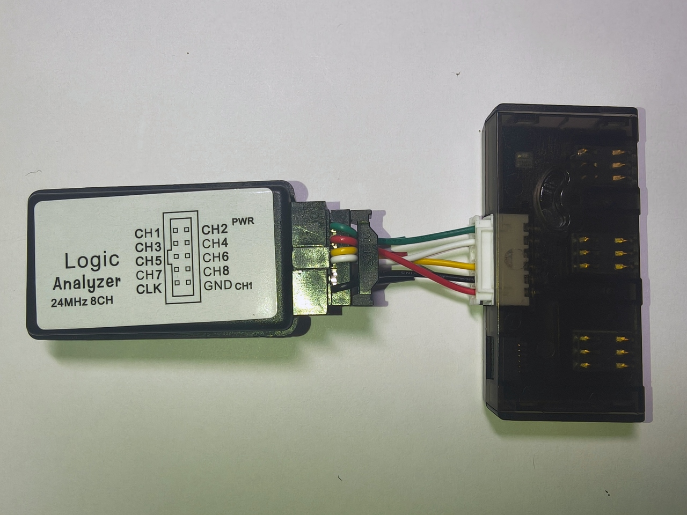
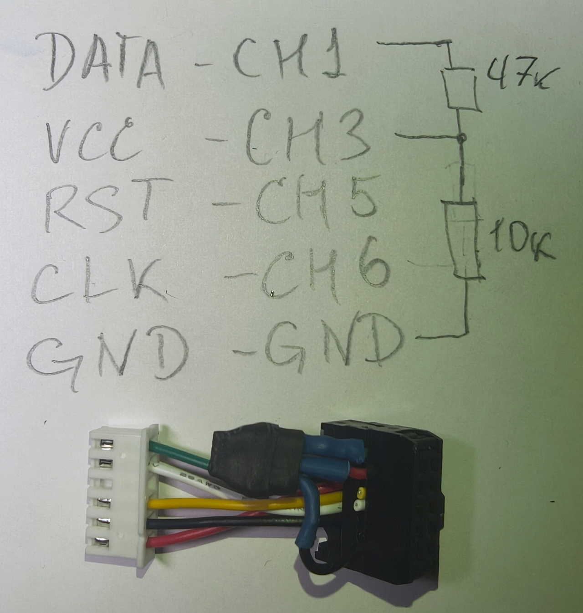

> English version: [README.md](README.md)

# sigrok_iso7816_stream

Форк [svenso/sigrok_iso7816](https://github.com/svenso/sigrok_iso7816) с
**живым GSMTAP-UDP-стримингом**: дешёвый логический анализатор FX2 (клон
Saleae) ведёт себя как сниффер SIMtrace2:

```
SIM-карта ⇄ ридер (пассивный съём с контактов)
    → логический анализатор FX2 (fx2lafw, 8 каналов, до 24 МГц)
    → sigrok-cli + декодер iso7816
    → GSMTAP UDP :4729  →  [simtrace2-pysniff](https://github.com/anttro/simtrace2-pysniff) / Wireshark
```

[simtrace2-pysniff](https://github.com/anttro/simtrace2-pysniff) —
рекомендуемый инструмент для визуализации живых трасс и просмотра
сохранённых записей; он также умеет импортировать и экспортировать
GSMTAP pcap-файлы (включая PCAP, который этот декодер пишет через опцию
`pcap_file=<path>`).

## Съём на практике


*Компоненты, использованные в сборке*


*Стенд снимает сессию SIM-карты телефона*


*Стенд снимает сессию картридера*


*Переходник для съёма с SIM*


*Подключение к контактам SIM*


*Съём коротким кабелем — меньше площадь контура и артефактов фронта*


*Детали подключения короткого кабеля*


*Короткий кабель с обвязкой*


*Короткий кабель с внешними подтягивающими резисторами — 10 кОм к GND на VCC (тянет вниз, когда питания нет), 47 кОм к VCC на DATA (быстрее фронт вверх)*

## Что добавлено поверх upstream

| Возможность | Описание |
|---------|-------------|
| Живой поток GSMTAP | Каждое декодированное событие отправляется как GSMTAP-SIM UDP-пакет (включено по умолчанию, повторяет поведение simtrace2-sniff) |
| Правильные sub_types | ATR=0x01 и PPS=0x02 теперь корректно помечаются в PCAP (в upstream всё писалось как APDU=0x00) |
| ATR/PPS в PCAP | ATR и объединённые запрос+ответ PPS выводятся как PCAP-пакеты |
| Отслеживание RST (опционально) | `rst_detect=true`: события assert/deassert сброса (sub_type 0x10) |
| Отслеживание VCC (опционально) | `vcc_detect=true`: события включения/выключения питания (sub_type 0x11) |
| PCAP сразу в файл | `pcap_file=<path>` пишет PCAP без перенаправления вывода оболочки |
| Деглитч стартового бита | Деглитч в 2 отсчёта в детекторе стартового бита убирает LOW-глитчи короче ETU от артефактов подтяжки FX2LP и предотвращает смещение байтов на быстрых телефонных трассах |

## Опции декодера

| Опция | По умолчанию | Описание |
|--------|---------|-------------|
| `clock_option` | `native` | `native`, `detect`, `sample_as_clock` (см. FAQ upstream) |
| `protocol` | `auto` | `auto`, `T=0`, `T=1` |
| `gsmtap_enable` | `true` | Живой GSMTAP UDP-стриминг |
| `gsmtap_host` | `127.0.0.1` | Хост назначения GSMTAP |
| `gsmtap_port` | `4729` | Порт назначения GSMTAP |
| `pcap_file` | *(пусто)* | Писать PCAP в этот файл вдобавок к бинарному выводу |
| `rst_detect` | `false` | Отслеживать события пина RST (требуется назначенный канал `rst`) |
| `vcc_detect` | `false` | Отслеживать события пина VCC (требуется назначенный канал `vcc`) |

Каналы: `clk`, `data` (обязательные); `rst`, `vcc` (опциональные —
назначайте только если соответствующий провод физически подключён).

## События GSMTAP

Заголовок GSMTAP: версия 2, тип SIM (0x04), UDP-порт 4729.

| sub_type | Имя | Полезная нагрузка |
|----------|------|---------|
| 0x00 | APDU | сырые байты пакета T=0/T=1 |
| 0x01 | ATR | сырые байты ATR |
| 0x02 | PPS | запрос + ответ PPS, склеенные (отклонение от спеки, см. ниже) |
| 0x10 | Событие RST (кастомное) | `[direction, level, 0x00]` |
| 0x11 | Событие VCC (кастомное) | `[direction, level, 0x00]` |

Семантика байтов полезной нагрузки:
- RST: `direction` 1 = сброс asserted (высокий→низкий), 0 = deasserted (низкий→высокий);
  `level` = уровень линии после перехода.
- VCC: `direction` 1 = питание подано (низкий→высокий), 0 = снято (высокий→низкий);
  `level` = уровень линии после перехода.

0x00/0x01 совпадают с gsmtap.h из libosmocore: стандартные значения и
полезные нагрузки. 0x02 переиспользует значение `GSMTAP_SIM_PPS_REQ` из
спеки, но несёт запрос и ответ, склеенные в одном пакете; спека разделяет
PPS на `PPS_REQ` (0x02) / `PPS_RSP` (0x03), поэтому Wireshark разбирает
такие пакеты как «PPS request», а `PPS_RSP` (0x03) не отправляется
никогда. 0x10/0x11 — кастомные расширения, не определённые в gsmtap.h из
libosmocore.

Расширения заголовка: флаги вроде `GSMTAP_FLAG_BAD_FCS` пишутся в байт
`res` заголовка, который официальный gsmtap.h помечает как зарезервированный
(RFU) — такое использование флагов следует конвенции simtrace2-sniff и не
является частью спецификации libosmocore.

## Использование

Быстрый старт после клонирования (см. «Установка» ниже):

```bash
./setup.sh   # проверить sigrok-cli, зарегистрировать симлинк декодера
./start.sh   # запись + поток GSMTAP на 127.0.0.1:4729
```

Умолчания `start.sh`: выводы D5=CLK, D0=I/O, D4=RST, D2=VCC, частота
дискретизации 16 МГц. Переопределяются аргументами:

```bash
./start.sh --clk=D1 --data=D6          # другое подключение
./start.sh --no-rst --no-vcc           # только CLK+I/O
./start.sh --host=10.0.28.7            # стримить на удалённый анализатор
./start.sh --pcap=session.pcap         # также записать декодированные события в PCAP
./start.sh --debug                     # полный вывод декодера и sigrok (все
                                       # строки аннотаций + libsigrok -l 4);
                                       # по умолчанию показываются только
                                       # декодированные APDU и предупреждения/ошибки
```

### Подключение

Рекомендуемый способ съёма — короткий кабель с внешними подтягивающими
резисторами (см. фото выше): 10 кОм к GND на VCC (тянет вниз без питания)
и 47 кОм к VCC на DATA (быстрее фронт вверх).  Его распиновка **фиксирована
и известна заранее** — см. таблицу «Распиновка» ниже — и в точности
совпадает с умолчаниями `start.sh` (`D5`=CLK, `D0`=I/O, `D4`=RST,
`D2`=VCC).  Автодетект подключения не нужен; выводы не меняются.

> **Сначала GND.** Сначала подключите GND и проверьте его вручную
> (мультиметром или заведомо исправным контактом) — отсутствующий или
> плохой контакт земли маскируется под все остальные неисправности сразу:
> плавающие линии, фантомные стартовые биты, кадры из одних нулей.

### Устойчивость к шумным сигналам

Живые записи могут глитчить (фантомный стартовый бит при включении питания
раньше сдвигал весь разбор ATR на единицу). Теперь декодер:

- проверяет байт TS в ATR (`0x3B`/`0x3F` по TS 102 221 §5.2.2) и
  ресинхронизируется на следующем настоящем спаде, если он неверен;
- никогда не даёт исключению при декодировании убить запись — ошибки
  логируются, аннотируются, а конечный автомат ресинхронизируется
  (конец потока по-прежнему завершается чисто);
- ограничивает продолжение цепочки T=1-блоков, чтобы мусор не мог
  зациклиться навсегда.

После принятого PPS декодер **следует переключению скорости**: в режиме
native CLK `clock_skip` становится равным F/D тактов CLK на бит (например,
512/16 = 32), что соответствует новой скорости UART у обеих сторон.  Живая
запись подтвердила, что сохранение 372 после PPS алиасит весь последующий
трафик.

**Тёплый сброс** (ридер заново подаёт RST примерно каждые ~1.6 с) заставляет
карту ответить свежим ATR на стандартных 372 тактах/бит.  Декодер
**заново взводит охоту за ATR по deassert RST**: состояние возвращается в
`FIND START`, native-пропуск сбрасывается в 372, счётчик охоты очищается —
поэтому повторный ATR разбирается как ATR, а не ошибочно читается как
TPDU-трафик на скорости, согласованной PPS.  **Защита стартового бита в
1.5 ETU** дополнительно отбрасывает фантомный `0x00`, который глитч на
холостом ходу может вставить перед этим ATR.  Требуется `rst_detect=true`
(назначенный канал `rst`); без него сброс в середине сессии всё равно
будет прочитан неверно.

### Решение проблем при живой записи

`start.sh` запускает одну `--continuous` запись, пока вы не нажмёте
**Ctrl+C** (`rc=130`).  stdin отвязан от sigrok-cli, поэтому нажатия
клавиш/Enter в терминале **не** останавливают запись (приглашение sigrok
«нажмите любую клавишу для остановки» отключено) — раньше это нажатие
ошибочно трактовалось как «преждевременный обрыв», хотя никакой
неисправности устройства не было.

Большая часть раннего «шума» в записях (ошибки чётности, мусор из-за
неверного кадрирования, дребезг линии VCC) была следствием плохо
декодированного конечного автомата, а не железа: переподключение съёма
ничего не давало, а переписанный декодер полностью это вылечил (re-arm по
тёплому сбросу, защита стартового бита 1.5 ETU, антидребезг VCC 10 мс,
сборка обмена T=0).  Чистая запись теперь декодируется с нулём мусора —
см. проверку `vs_reader.py` ниже.

Если запись *всё-таки* завершается сама (`rc=0`), устройство действительно
перестало стримить; обычный подозреваемый — потолок пропускной способности
USB у FX2 при длительной высокой частоте дискретизации.

```bash
./start.sh --pcap=s.pcap --log=s.log           # также записать события и лог rc=
./start.sh ... --samplerate=24M                # больше запаса по таймингу при необходимости
./start.sh ... --klog                          # также записать журнал ядра
./start.sh ... --debug                         # полный вывод: все строки аннотаций
                                               # + внутренности libsigrok на -l 4
                                               # (по умолчанию: только APDU + предупреждения)
```

`start.sh` пишет непрерывный поток на настроенной частоте (по умолчанию
16 МГц) до Ctrl+C (`rc=130`).  Здоровая запись никогда не завершается
сама; если FX2 роняет USB-передачу в середине сессии (нестабильное
устройство, `rc=0` «device stopped streaming»), запись автоматически
перезапускается, чтобы не потерять сессию — она перезапускается при каждом
`rc=0`, пока вы не нажмёте Ctrl+C или не сработает `--max-restarts=N`
(по умолчанию 20; `0` = без ограничения), с паузой `--restart-delay=S`
(по умолчанию 2 с).  При перезапуске с `--pcap=FILE` запись каждой сессии
пишется в `FILE.<N>.<ext>`, поэтому перезапуск никогда не перезаписывает
предыдущую, а повторяющаяся строка завершения
`sr_session_stop: session was NULL` фильтруется из stderr.

- `--no-loop` отключает авто-перезапуск (только одна запись).
- `--loop` принудительно включает авто-перезапуск (это поведение по умолчанию).
- `--max-restarts=N` ограничивает число перезапусков (по умолчанию 20; `0` = без ограничения).
- `--restart-delay=S` — секунды ожидания между перезапусками (по умолчанию 2).
- `--log` сохраняет строку вердикта `rc=` для завершения сессии.
- Декодер пишет `SIGNAL INTEGRITY WARNING`, когда ≥ 8 из последних
  64 кадров не проходят проверку чётности.
- Десинхронизированные TPDU (обмены с ошибкой кадрирования) сохраняются,
  но помечаются `GSMTAP_FLAG_BAD_FCS` в байте `res` заголовка GSMTAP —
  видно в Wireshark как предупреждение BAD-FCS.
- Заголовок T=0 со структурно некорректным INS (ISO 7816-4 §12.1.1:
  `0x00`, `0x6x`/`0x9x` или нечётный младший бит) почти всегда сдвинут на
  один байт из-за лишнего ведущего байта (например, дочитанного остатка
  SW2 после PACKETEND).  Вместо молчаливого отбрасывания всего 5-байтового
  окна (из-за чего следующий байт становился фиктивным CLA и проглатывал
  остаток диалога в один CONCAT-пакет) декодер отбрасывает только ведущий
  байт и перекадрирует остальные, восстанавливая настоящую команду.
  Каждый потреблённый, но не выведенный байт явно логируется
  (`discarded byte 0x…: reason`); отбрасывания холостых 0x00/0xFF
  ограничены по частоте, отбрасывания не-холостых байтов всегда дают
  аннотацию декодера.

Производительность: в режиме native CLK декодер один раз калибрует число
отсчётов на фронт CLK по первому кадру ATR, а затем продвигает битовую
синхронизацию одиночными пропусками отсчётов вместо ожидания на каждый
фронт CLK.  Переключение скорости по PPS отслеживается через
`clock_skip = F/D`; никакой перекалибровки после PPS или по чётности нет.

### Сравнение режимов на железе FX2 (результат A/B)

- `native` декодировал реальный трафик (ATR, переключение PPS, 100+ валидных
  APDU за 12-секундное окно); единственным устойчивым артефактом был
  «дребезг» линии VCC — звон ~1 кГц, который теперь подавляет антидребезг 10 мс.
- `detect` ни разу не дал пригодной сессии на этом стенде: он полностью
  пропускал переключение скорости по PPS (обработка PPS не срабатывала) и
  алиасил весь трафик после PPS; вторая попытка поймала мёртвую линию I/O.

`native` остаётся режимом по умолчанию.  Используйте `--clock=detect`
только для офлайн-экспериментов без PPS.  Запись, целиком состоящая из
нулевых кадров, означает, что съём потерял контакт с линией.

Чётность — **чётная** по TS 102 221 («чётное число битов, установленных в
'1', включая бит чётности»); кадры, не прошедшие проверку, помечаются
`CHKSUM ERROR`, но всё равно декодируются.

Эквивалентные «сырые» команды sigrok-cli:

```bash
# Минимум: только CLK+I/O, живой поток на localhost:4729
sigrok-cli -d fx2lafw --config samplerate=12M --continuous \
  -P iso7816:clk=D0:data=D1:clock_option=detect -A iso7816

# Полное подключение: CLK + I/O + RST + VCC с отслеживанием событий линий
sigrok-cli -d fx2lafw --config samplerate=12M --continuous \
  -P iso7816:clk=D5:data=D0:rst=D4:vcc=D2:clock_option=native:rst_detect=true:vcc_detect=true \
  -A iso7816

# Поток на удалённый анализатор / отключить стриминг / писать PCAP-файл
... -P iso7816:...:gsmtap_host=10.0.28.7 ...
... -P iso7816:...:gsmtap_enable=false ...
... -P iso7816:...:pcap_file=trace.pcap ...

# Классический режим upstream: бинарный PCAP в stdout
sigrok-cli -i capture.sr -P iso7816:clk=2:data=0 -B iso7816=pcap > out.pcap
```

### Распиновка

Каналы клона FX2 назначаются через `-P iso7816:clk=N:data=N:rst=N:vcc=N`.
Рекомендуемый съём коротким кабелем (с внешними подтягивающими резисторами)
использует фиксированные выводы, которые в точности совпадают с умолчаниями
`start.sh`; `--clk`/`--data`/`--rst`/`--vcc` переназначают их, если вы
подключили иначе:

| Канал FX2 | Контакт SIM | Сигнал |
|-------------|-------------|--------|
| D0 | C7 | I/O |
| D2 | C1 | VCC (только цифровой уровень!) |
| D4 | C2 | RST |
| D5 | C3 | CLK |
| GND | C5 | GND |

Входной порог FX2 близок к TTL (~1.4 В): карты класса 1.8 В могут читаться
нестабильно; классы 3 В/5 В — нормально.

**Частота дискретизации и 8-битный режим (важно):** номинальные 24 МГц FX2
доступны только при дискретизации в 8-битном режиме, т.е. когда **включены
только каналы D0–D7**.  Включение 9-го канала (A0/аналоговый на клонах CWAV
AX) или любого аналогового входа переводит сбор в 16-битный, который
libsigrok ограничивает 12 МГц.  Поэтому `start.sh`/`start.bat` явно
передают `-C D0,D1,D2,D3,D4,D5,D6,D7` и по умолчанию используют **16 МГц**
(с комфортным запасом под потолком USB 24 МГц; ~3.3 отсчёта на такт CLK
4.8 МГц).  `setup.sh`/`setup.bat` проверяют и сообщают фактический максимум
вашего железа при том же ограничении.

## Установка

### Linux

```bash
git clone git@github.com:anttro/sigrok_iso7816_stream.git
cd sigrok_iso7816_stream
./setup.sh
```

`setup.sh` проверяет, что установлены sigrok-cli и пакет прошивки FX2
(`sigrok-firmware-fx2lafw`), создаёт симлинк репозитория в
`~/.local/share/libsigrokdecode/decoders/iso7816` (пользовательские
декодеры перекрывают системные) и опрашивает подключённое устройство на
предмет максимальной поддерживаемой частоты дискретизации.

### Windows

Предварительные требования:

1. **sigrok-cli** — установщик для Windows (0.7.2 x86_64) с
   [sigrok.org/wiki/Downloads](https://sigrok.org/wiki/Downloads).
   Если он не запускается с ошибкой `0xc0150002`, установите
   [Visual C++ 2010 Redistributable](https://www.microsoft.com/en-us/download/details.aspx?id=26999)
   (`msvcr100.dll` требуется встроенному Python-рантайму).
2. Прошивка fx2lafw поставляется вместе с установщиком — отдельно скачивать не нужно.

Настройка драйвера (донглам FX2 нужен WinUSB, вендорский драйвер не подойдёт):

- Запустите **Zadig**, который лежит *внутри* каталога установки sigrok-cli
  (также доступен из меню «Пуск»). Выберите устройство FX2 в выпадающем
  списке и установите драйвер **WinUSB**.
- После загрузки прошивки устройство переподключается с другим VID/PID —
  если оно всё ещё не находится, запустите Zadig **второй раз** для
  переподключившегося устройства.
- Windows привязывает драйверы к USB-порту, когда нет серийного номера:
  перенос донгла в другой порт может потребовать повторить Zadig.

Затем:

```bat
git clone git@github.com:anttro/sigrok_iso7816_stream.git
cd sigrok_iso7816_stream
setup.bat
```

`setup.bat` проверяет sigrok-cli и встроенную прошивку, регистрирует декодер
этого репозитория через junction в
`%LOCALAPPDATA%\libsigrokdecode\decoders\iso7816` (подтверждается тем, что
`sigrok-cli -L` показывает `iso7816`), и опрашивает устройство на предмет
поддерживаемых частот дискретизации.

Запись работает так же, как в Linux:

```bat
start.bat                   rem запись + поток GSMTAP
```

Примечание: bat-файлы требуют переводов строк CRLF; репозиторий следит за
этим через `.gitattributes`, поэтому свежий клон в Windows уже корректен.

## Заметки и ограничения по детектированию RST/VCC

- События детектируются **асинхронно до первого ATR** (включение питания /
  снятие сброса фиксируются, как только уровень стабилизируется) и **на
  границах пакетов** между T=0/T=1 в дальнейшем.
- Фронты, происходящие целиком *внутри* передачи пакета, наблюдаются как
  итоговое изменение уровня на следующей границе; короткие импульсы внутри
  пакета могут быть пропущены.
- VCC — только цифровой: декодер видит «питание есть/нет», но никогда
  не класс напряжения (1.8/3/5 В).
- **RST и VCC используют гистерезис стабильности уровня в 10 мс**
  (масштабируется от частоты дискретизации): новый уровень сообщается
  только после того, как он непрерывно стабилен ≥ 10 мс — либо потому, что
  он держится так долго, либо потому, что он закончился, продержавшись
  столько.  Это делает включение и выключение питания *симметричными*:
  линия VCC, которая **звенит на фронте** (шумный/плавающий съём), больше
  не теряет событие «VCC on» — оно срабатывает, как только линия
  устанавливается в HIGH, вместо того чтобы быть съеденным дребезгом
  фронта.  RST использует ту же схему, поэтому короткий глитч RST больше
  не вызывает фантомный re-arm по тёплому сбросу.
- **События VCC в целом ненадёжны — лучше не отслеживать VCC.** Плавающий
  или неподключённый пин съёма VCC всегда читается как HIGH (логическая
  единица без нагрузки), поэтому декодер постоянно видит «питание подано»
  и выдаёт ложные события питания при каждом дребезге.  Если ваш съём не
  берёт VCC с чистого нагруженного источника, лучше **оставить канал `vcc`
  неназначенным** (не передавать `--vcc`) и держать `vcc_detect=false`;
  отслеживания RST обычно достаточно, чтобы видеть сбросы.  Включайте
  отслеживание VCC только на съёме с надёжным измерением VCC (и надёжным
  GND — см. заметки о подключении).
- Неназначенные опциональные каналы игнорируются, даже если
  `rst_detect`/`vcc_detect` включены (защита через `has_channel()`).

## Тестирование

Проверено на примерах записей из upstream:

```bash
# ATR+PPS+54 APDU из записи ридера test_8 (~19 с декодирования)
# Поток GSMTAP проверен через tshark (ATR/APDU разбираются нативно),
# кастомные события 0x10/0x11 — через UDP-слушатель, и сквозным путём
# в сервер simtrace2-pysniff (POST /api/capture/start → decode → stop).
```

Синтетический генератор VCD, покрывающий краевые случаи RST/VCC, живёт в
заметках проекта (`projects/SIGROK_ISO7816.md` в родительском рабочем
пространстве).

### Проверка по SDK ридера (`tools/vs_reader.py`)

На контролируемом стенде (PCSC-ридер под управлением софта) эталонный
журнал APDU из SDK ридера можно сравнить с декодированным PCAP:

```bash
sigrok-cli -i <trace>.sr \
  -P iso7816:clk=D5:data=D0:rst=D4:vcc=D2:clock_option=native:rst_detect=true:vcc_detect=true:gsmtap_enable=false:pcap_file=out.pcap \
  -A iso7816
python3 tools/vs_reader.py <reader-log>.log out.pcap
```

`vs_reader.py` выравнивает каждый обмен из журнала ридера с APDU из записи
(побайтовое LCS-совпадение) и классифицирует остатки как proactive/CAT
(невидимые для SDK ридера), pre-capture/потерянные или мусор.
Запись, начатая в середине сессии, тёплые сбросы которой раньше давали
4 мусорных события, с re-arm и защитой стартового бита декодируется в
**0 мусора** (`RESULT: OK - capture fully explained`).

test_7 (4 сброса ATR, фрагментирующих сессию) теперь захватывает все 37/37
обменов ридера (было 10/37 до исправления деглитча).  Телефонные трассы
Samsung с 16 CLK/ETU (F=512/D=32) теперь разбираются на 924 отдельных
обмена T=0 (раньше сливались в 52 APDU завышенного размера).

Воспроизводимые фикстуры трасс (хранятся локально, вне репозитория)
покрывают сессии ридера с контролируемого стенда (с эталонными журналами
SDK ридера), телефонные записи с гейтированным CLK и **записи холодного
старта**, начинающиеся *до* включения питания (VCC/RST низкие при t=0).
Четыре фикстуры Samsung — холодные старты, снятые новым коротким кабелем
(провода 30 мм, внешние подтягивающие резисторы GND→VCC и VCC→DATA), с
каналами `DATA/VCC/RST/CLK` на битах 0/2/4/5; варианты `sim2` обрезаны до
окна включения питания.

### Записи холодного старта (запись начинается до включения питания)

Когда запись начинается до включения питания, декодер должен взвести охоту
за ATR, потому что RST всё ещё низкий на отсчёте 0: он инициализирует
начальные уровни VCC/RST на первом шаге (вместо того чтобы по умолчанию
считать их снятыми) и при низком RST на старте входит в `FIND START` с
очищенным ETU, поэтому переходы DATA при включении питания до ATR не могут
зафиксировать фиктивную битовую скорость.  Затем он декодирует полный ATR
(`3b9f96801fc78031e073fe2117574a3382033339001e`) с 0 мусора:

```bash
sigrok-cli -i <coldboot>.sr \
  -P iso7816:clk=CLK:data=DATA:rst=RST:vcc=VCC:clock_option=native:protocol=T=0:rst_detect=true:vcc_detect=true:gsmtap_enable=false:pcap_file=out.pcap \
  -A iso7816
```

Снятие RST (deassert), которое приходит, пока разбор ATR уже идёт, больше не
перевзводит охоту посреди чтения — оно логирует `RST deasserted (hunt/ATR
already in progress)` и не трогает разбираемый ATR (test_8/test_7
CHKSUM 18→0).

### Сценарии записи: ридер (постоянный CLK) и телефон (Clock Stop Mode)

Декодер обрабатывает две физически разные схемы съёма SIM:

- **Запись ридера / постоянный CLK** — ридер ведёт ровный CLK всю сессию.
  В режиме mid-session запись декодируется в **0 мусора**
  (`RESULT: OK`) относительно эталона из SDK ридера
  (`tools/vs_reader.py <reader-log>.log out.pcap`).
  Записи ридера с тёплыми сбросами используют fallback с синтетическим
  T=0-ATR.

- **Запись телефона / остановленный CLK** — телефон гейтирует или
  останавливает CLK между передачами (Clock Stop Mode), поэтому ETU не
  равен стандартным 372 тактам и не может быть выведен из CLK.  Запускайте
  с `protocol=T=0`; декодер восстанавливает ETU из линии DATA подсчётом
  фронтов, фиксирует его и декодирует устойчивым к дрейфу edge-list
  читателем битов.  Команды T=0 case 3/4 (например, `80 12`/`80 14`
  STK envelope) объединяются в один APDU команда→ответ.  Деглитч стартового
  бита в 2 отсчёта убирает LOW-глитчи короче ETU, вызванные артефактами
  внутренней подтяжки FX2LP, и предотвращает смещение байтов на быстрых
  телефонных трассах.

### Проверенные скорости данных и ETU

Все трассы декодированы на **частоте дискретизации 16 МГц**, 0 мусора,
RESULT: OK.  Начиная с v1.5.0 каждая трасса из набора примеров также
сообщает **0 CONCAT** (перекадрирование по некорректному INS устранило
последнее семейство проглатывания нескольких обменов на
4gmodem/A55_sim2/S21p_sim2).

| Трасса | Режим CLK | ETU (отсчёты) | CLK/ETU | Конвенция | Примечания |
|-------|----------|---------------|---------|------------|-------|
| test_8 | постоянный | ~43 | 372 (стандарт) | Direct | PC/SC ридер, ATR+PPS+APDU |
| test_7 | постоянный | ~43 | 372 (стандарт) | Direct | PC/SC ридер, тёплые сбросы |
| xiaomi | гейтированный/остановленный | ~53 | восстановлен из DATA | Direct | Телефон, середина сессии |
| samsung | гейтированный/остановленный | ~72 | 16 (F=512/D=32) | Direct | Телефон, нестандартный F/D, меню STK |

Декодер автоопределяет ETU по трассе и выбирает подходящий читатель битов
(CLK-синхронный для постоянного CLK, edge-list для гейтированного/
остановленного CLK).  Никакой ручной настройки не требуется, кроме
`clock_option=native` и `protocol=T=0` для телефонных записей.

Рекомендуемые вызовы:

```bash
# Запись ридера (контролируемый стенд, CLK всегда работает)
sigrok-cli -i <trace>.sr \
  -P iso7816:clk=CLK:data=DATA:rst=RST:vcc=VCC:clock_option=native:rst_detect=true:vcc_detect=true:gsmtap_enable=false:pcap_file=out.pcap \
  -A iso7816
python3 tools/vs_reader.py <reader-log>.log out.pcap

# Запись телефона (середина сессии, гейтированный/остановленный CLK)
sigrok-cli -i <phone>.sr \
  -P iso7816:clk=CLK:data=DATA:rst=RST:clock_option=native:rst_detect=true:vcc_detect=false:protocol=T=0:gsmtap_enable=false:pcap_file=out.pcap \
  -A iso7816
```

## Лицензия

GPL-2.0+, как и upstream.
